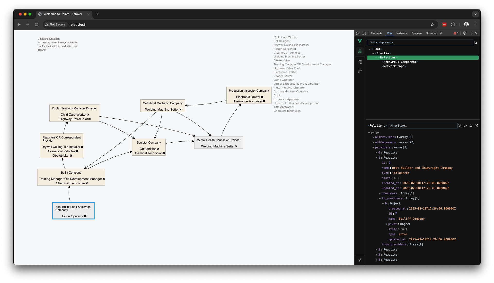

# Analyse réseau de valeur
## Backend
Côté backend Laravel, je ne pense pas qu'on ait besoin de packages pour la partie réseau de valeur. On peut simplement
utiliser les modèles Eloquent pour gérer les données.

### Modèles
- Provider: Modèle pour les sociétés/fournisseurs
    - name: string
    - type: string (acteur/fournisseur)
    - status: string (pour le smiley)
- Consumer: Modèle pour les rôles/jobs
    - name: string
    - tag: array (les icônes)

### Relations
- Many-to-Many: Provider - Consumer
- Many-to-Many: Provider - Provider
    - table pivot avec: to_provider et from_provider pour indiquer le sens de la relation

### Mapping vers un graphe
Les _nodes_ du graphe seront les Providers.  
Les _edges_ représenteront les relations entre les Providers.

## Frontend

### Comparatif de libraries graphe

|                          | GoJS       | D3.js         | Vis.js    | Cytoscape |
|--------------------------|------------|---------------|-----------|-----------|
| Flexibilité              | Élevée     | Très élevée   | Moyenne   | Élevée    |
| Facilité d'utilisation   | Moyenne    | Difficile     | Facile    | Moyenne   |
| Documentation            | Excellente | Excellente    | Bonne     | Bonne     |
| Licence                  | Payante    | Gratuite      | Gratuite  | Gratuite  |
| Customisation des noeuds | Moyenne    | Moyenne       | Difficile | Difficile |

### Choix de la librairie
Je pense que GoJS est la meilleure option pour ce cas. La licence payante assure un support de qualité et rassure sur
la pérennité du projet. Le degré de customisation possible pour les noeuds est un grand avantage pour représenter les
acteurs et les fournisseurs de manière claire et adaptée.

## POC

